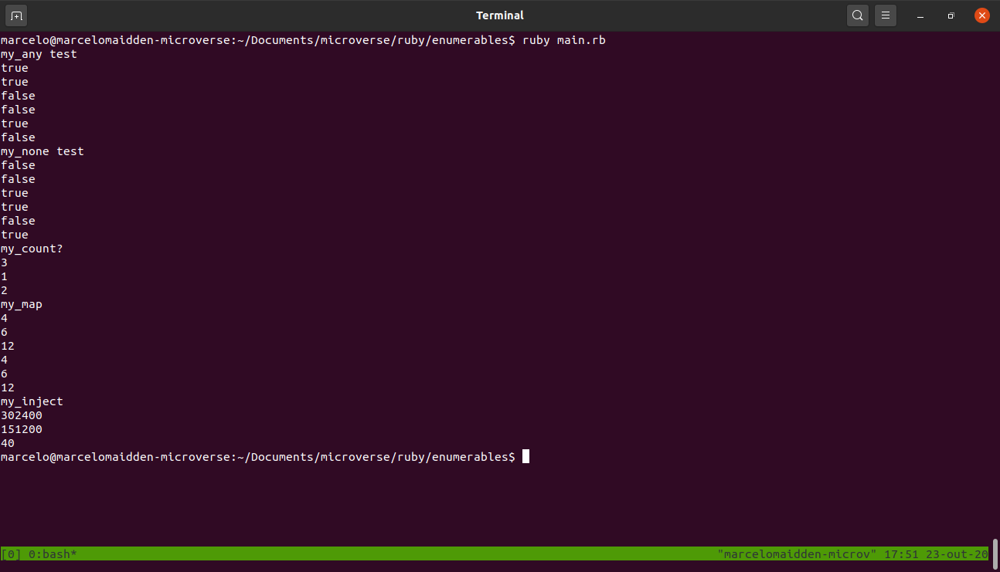

# The Enumerables project

# A project made in Ruby recreating the enumerables methods only for educational purposes

## Built With

- Ruby

## Getting started
    In order to run the project locally clone the repository and run the command bellow
    - ruby main.rb

## Live Demo

[Live Demo Link](https://repl.it/repls/RemorsefulAnotherDisk#README.md)

## installation

You MUST have Ruby installed in your system. If you don't have it installed you can go this page [Install Ruby](https://www.theodinproject.com/courses/web-development-101/lessons/installing-ruby)

After that install rspec by typing the command below:

    gem install rspec

## how-to-test

In order to test our project type the command below:

    rspec --format doc

## Authors

**Juan Andrés**

- GitHub: [@Jarfsoft](https://github.com/Jarfsoft)
- Twitter: [@Jarfsoft](https://twitter.com/Jarfsoft )
- LinkedIn: [Juan Andrés](https://www.linkedin.com/in/juan-raudales-flores-7b0a3b113/)

**Marcelo Araújo**

- GitHub: [@marcelomaidden](https://github.com/marcelomaidden)
- Twitter: [@marcelomaidden](https://twitter.com/marcelomaidden)
- LinkedIn: [Marcelo Fernandes de Araújo](https://www.linkedin.com/in/marcelo-fernandes-de-ara%C3%BAjo-56700a171/)

👤 **Alan Soto**

- Github: [@AlanSoto31](https://github.com/AlanSoto31)
- Twitter: [@Alan95081574](https://twitter.com/Alan95081574)
- Linkedin: [linkedin Profile](https://www.linkedin.com/in/alan-soto-valle-b9a0511aa/)

## Acknowledgements
- Ruby creators

##  Contributing

Contributions, issues, and feature requests are welcome!

## Show your support

Give a ⭐️ if you like this project!

## License

This project is [MIT](./LICENSE) licensed.
